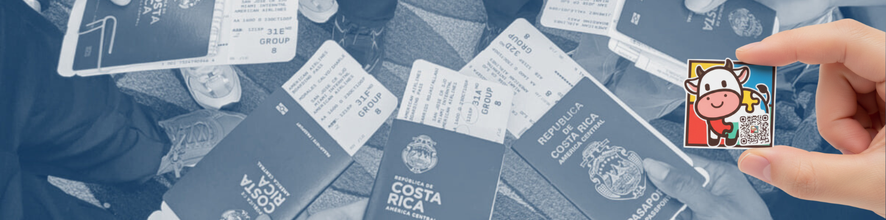

# Hello, World!

---
> You'll probably won't find a lot here, I usually make private repositories cuz I'm a bit shy, but I hope you like what you see.
- Top 5 National STEM Fair Finalist (Costa Rica, 2025)
- Developer of Moody, an AAC communication app
- Cisco Networking Academy Certified
- Stanford Code in Place 2026 Graduate
- Youth Ambassadors Program Exchange Alumnus
- Robotics Enthusiast, SUMOBOT participant
- Network Support and Operating Systems Student
- Interested in Computer Science and Engineering
